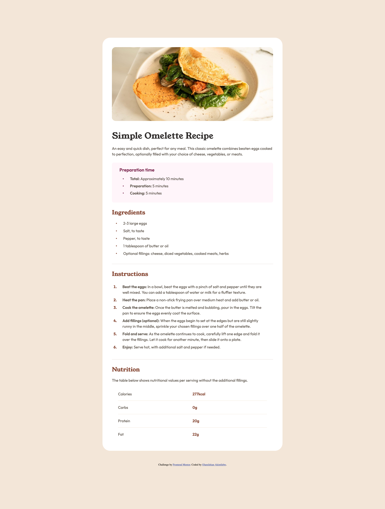

# Frontend Mentor - Recipe page solution

This is a solution to the [Recipe page challenge on Frontend Mentor](https://www.frontendmentor.io/challenges/recipe-page-KiTsR8QQKm). Frontend Mentor challenges help you improve your coding skills by building realistic projects. 

## Table of contents

- [Overview](#overview)
  - [Screenshot](#screenshot)
  - [Links](#links)
- [My process](#my-process)
  - [Built with](#built-with)
  - [What I learned](#what-i-learned)
  - [Continued development](#continued-development)
- [Author](#author)

## Overview

### Screenshot

### Links

- Solution URL: [source code](https://github.com/hayohtee/recipe-page)
- Live Site URL: [live site](https://hayohtee.github.io/recipe-page/)

## My process

### Built with

- Semantic HTML5 markup
- CSS custom properties
- Flexbox
- Mobile-first workflow
- Media Query

### What I learned

I learned how to markup HTML document semantically and also various CSS fundamentals like working with relative and absolute units with a preference for relative units for responsiveness, the box model, flex box, media queries and also CSS variables.

### Continued development

I plan on improving my building more projects and also learn new CSS concepts like Grid and also positioning and stacking.

## Author

- Website - [Olamilekan Akintilebo](https://github.com/hayohtee)
- Frontend Mentor - [@hayohtee](https://www.frontendmentor.io/profile/hayohtee)
- Twitter - [@hayohtee](https://x.com/hayohtee)
